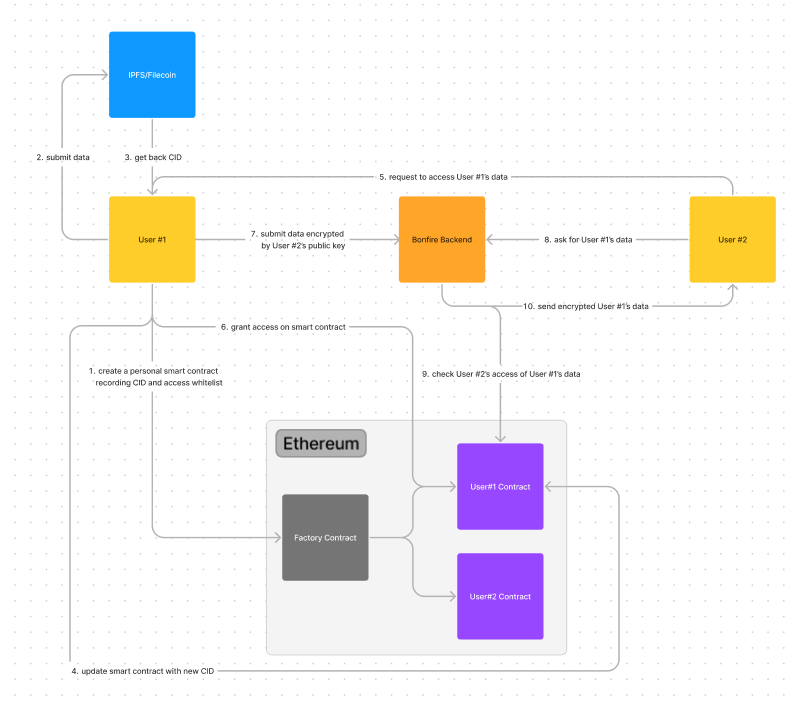
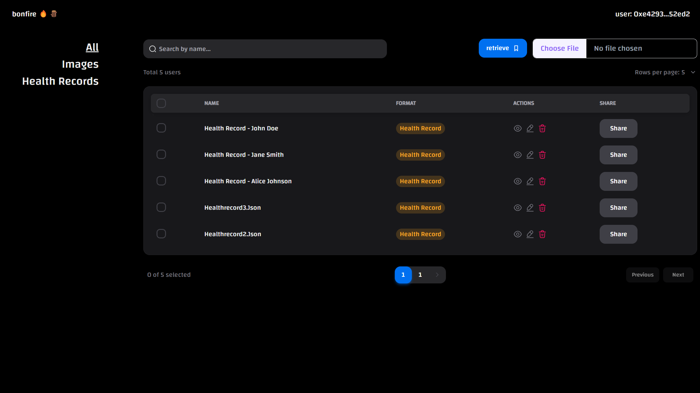
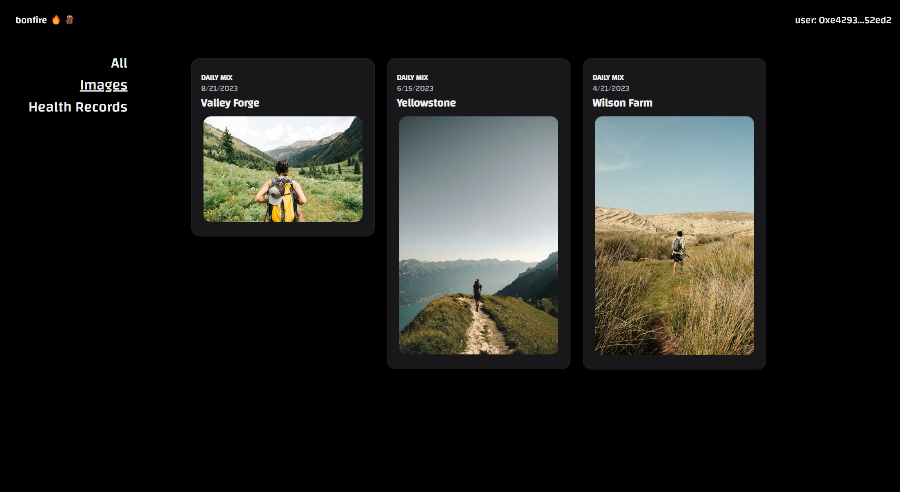
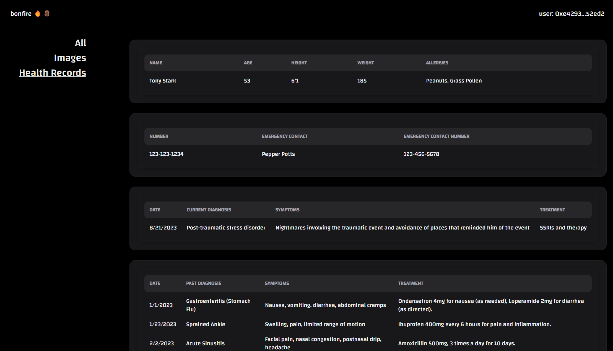

## Bonfire 🔥🪵
Bonfire is decentrazlied google drive, a cloud that truly belongs to you. Starting with your health records, it aims to enable true ownership of personal data. Built with React, Truffle, Django and on Ethereum/Linea blockchain. 

smart contract: https://github.com/bonfireapp2023/bonfire-smart-contracts  
backend: https://github.com/bonfireapp2023/bonfire-backend  

## Run Locally
* `npm install`
* `npm start`
* `json-server -p 4000 db.json` (start our demo backend)
   
## Bounties
* To Infura and Beyond: we deployed our smart contracts with Truffle to Linea via Infura, see our [truffle-config.js](https://github.com/bonfireapp2023/bonfire-smart-contracts/blob/main/truffle-config.js#L57C20-L57C20)
    
* Mobile Fun with MetaMask SDK: we used the MetaMask SDK for wallet connection, see our [connect_wallet](https://github.com/bonfireapp2023/bonfire-frontend/blob/main/src/pages/landing.js) funciton in frontend
    
* IYKYK Linea edition: 
    • deployed smart contract: https://explorer.goerli.linea.build/address/0x96D7cCfa8cB77CD5E807d88967D31940b8258EcF  
    • see our [truffle-config.js](https://github.com/bonfireapp2023/bonfire-smart-contracts/blob/main/truffle-config.js#L57C20-L57C20)  
      
* Make a Dapp That Slaps, No Cap: see the bounties above

## Architecture

## UI

